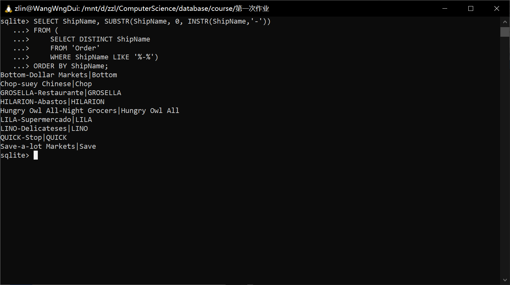
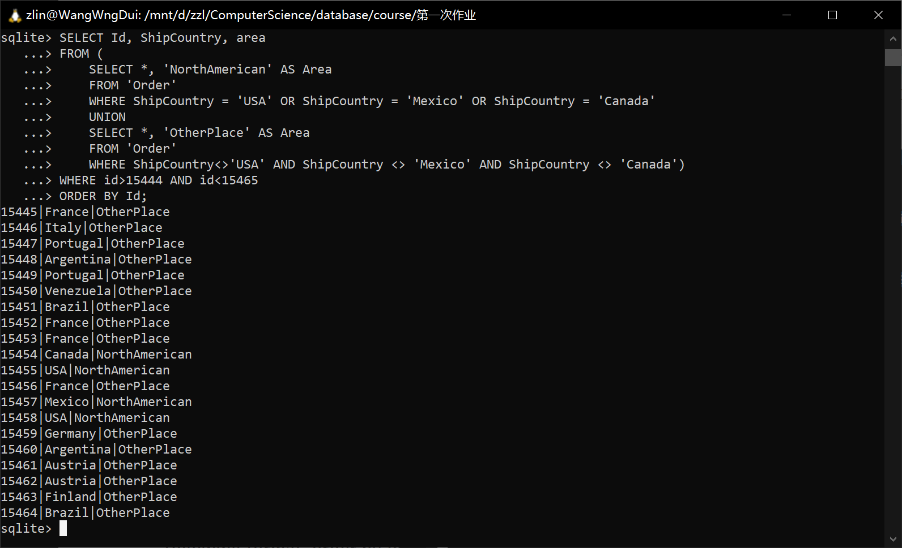
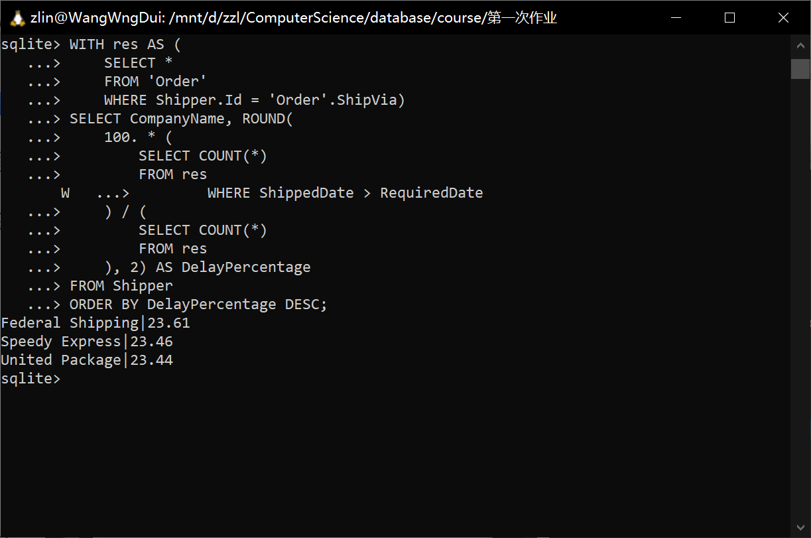
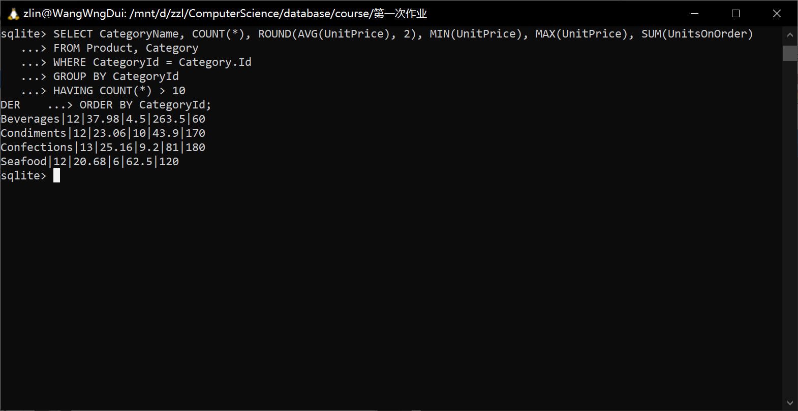
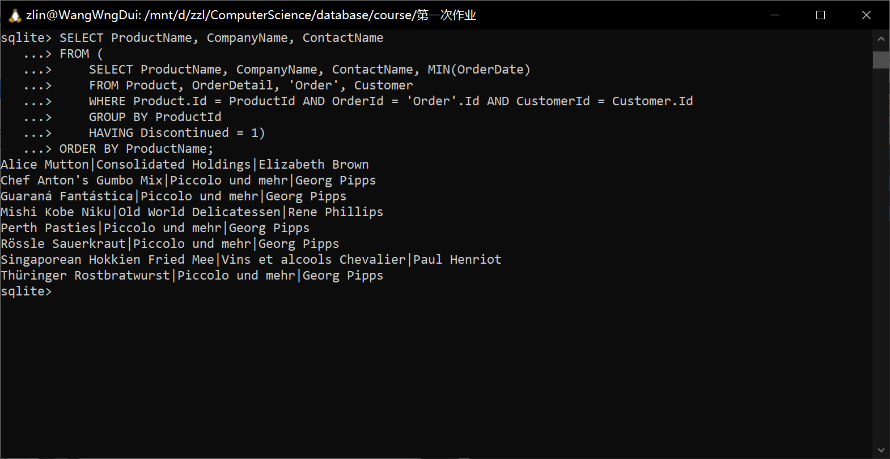
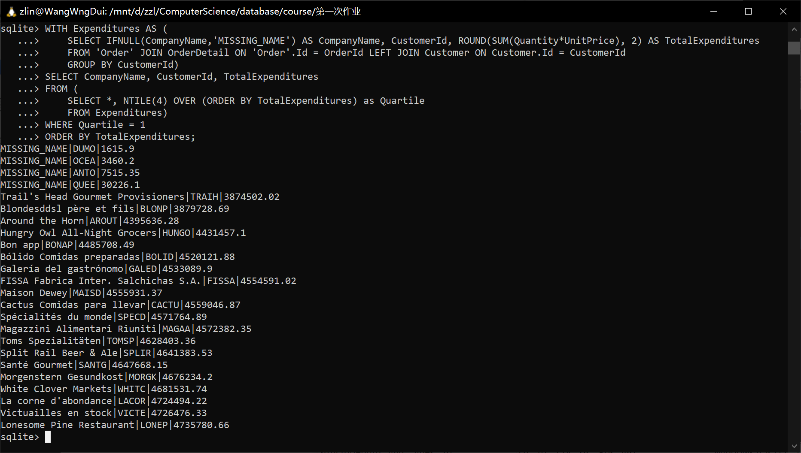
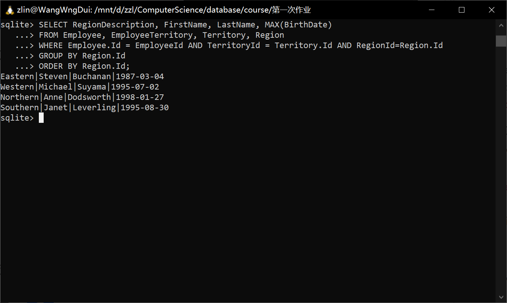
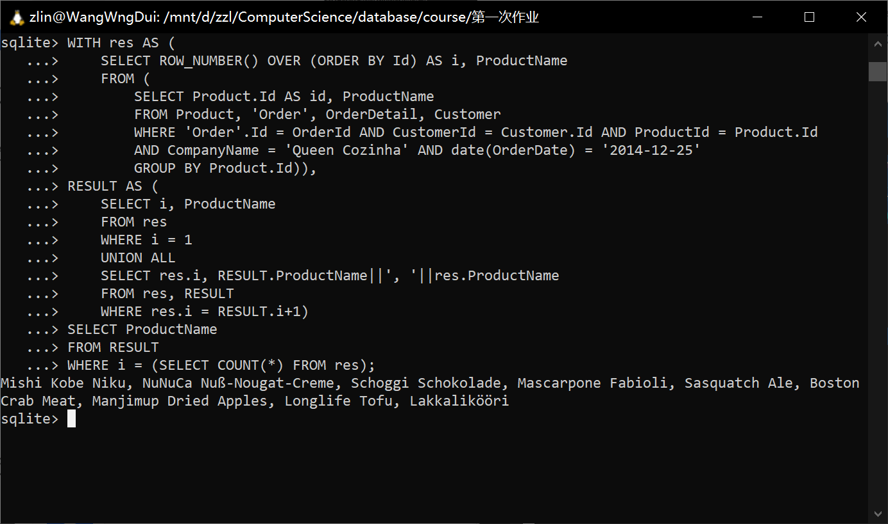

# SCU_Database
姓名：张则灵

学号：2020141460124
# 作业1运行结果
Q1_STRING_FUNCTION:

Q2_NORTHAMERICAN:

Q3_DELAYPERCENT:

Q4_AGGREGATES:

Q5_DISCONTINUED:

Q6_ORDER_LAGS:

Q7_TOTAL_COST_QUARTILES:

Q8_YOUNGBLOOD:

Q9_CHRISTMAS:

